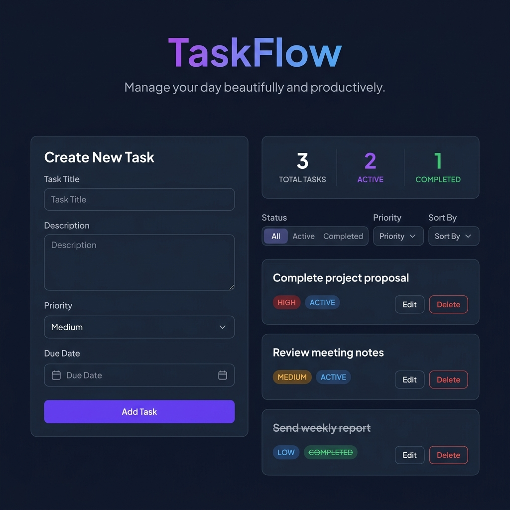
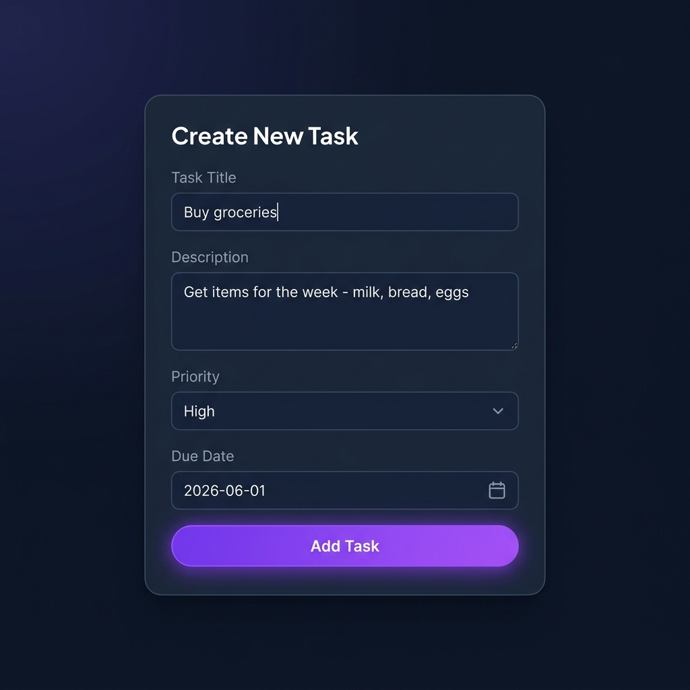
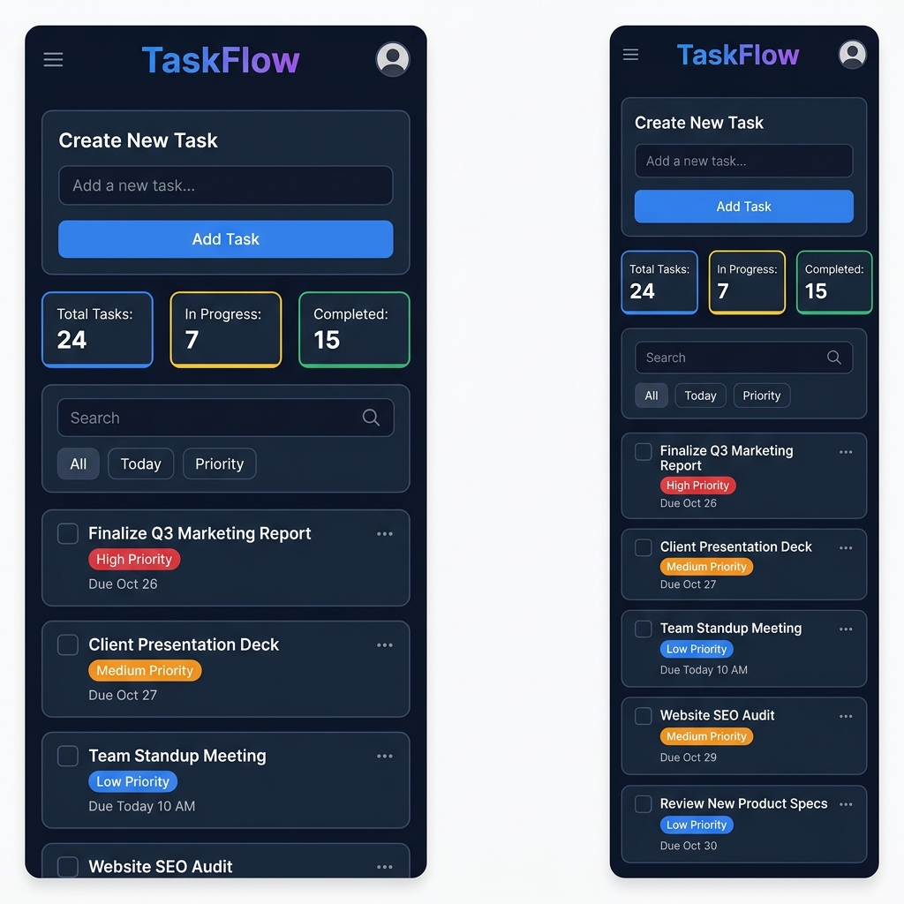
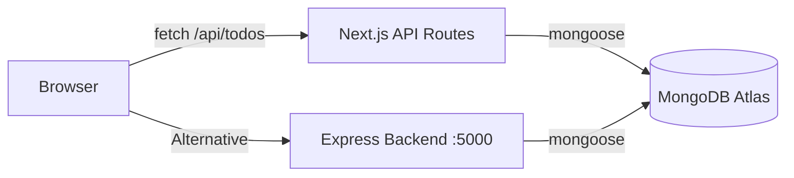

<p align="center">
  <h1 align="center">✨ TaskFlow</h1>
  <p align="center">
    <strong>A premium, full-stack task management application built with Next.js & Express</strong>
  </p>
  <p align="center">
    Manage your day beautifully and productively.
  </p>
</p>

<p align="center">
  
  
  
  
  
</p>

---

## 📸 Screenshots

### Dashboard — Full View

> The main workspace featuring the task creation form, real-time stats panel, smart filters, and a clean task list with priority badges.

### Creating a Task

> The intuitive task creation form with title, description, priority selector, and optional due date.

### Mobile Responsive

> Fully responsive layout that adapts beautifully to mobile screens with a stacked single-column design.

---

## 🚀 Features

| Feature | Description |
|---------|-------------|
| ✅ **CRUD Operations** | Create, read, update, and delete tasks seamlessly |
| 🎨 **Premium Dark UI** | Sleek dark theme with glassmorphism, gradients, and micro-animations |
| 📊 **Real-time Stats** | Live task counters for total, active, and completed tasks |
| 🔍 **Smart Filters** | Filter by status (All / Active / Completed) and priority (Low / Medium / High) |
| 📱 **Fully Responsive** | Looks great on desktop, tablet, and mobile |
| 🏷️ **Priority Levels** | Color-coded priority badges — Low (blue), Medium (amber), High (red) |
| 📅 **Due Dates** | Optional due date tracking with overdue warnings |
| ✏️ **Inline Editing** | Edit tasks in-place without leaving the page |
| 🔄 **Sorting** | Sort by creation date, due date, or priority |
| ☁️ **Cloud Database** | MongoDB Atlas for persistent, cloud-hosted storage |

---

## 🏗️ Architecture

TaskFlow uses a **monorepo** structure with two independent applications:

```
todo/
├── todo-app/              # 🖥️ Next.js Frontend (Port 3000)
│   ├── app/
│   │   ├── api/todos/     # Next.js API Routes (server-side)
│   │   ├── globals.css    # Design system & styles
│   │   ├── layout.tsx     # Root layout with metadata
│   │   └── page.tsx       # Main dashboard page
│   ├── components/
│   │   ├── TodoForm.tsx   # Task creation form
│   │   ├── TodoItem.tsx   # Individual task card with edit/delete
│   │   ├── TodoList.tsx   # Filterable, sortable task list
│   │   └── ui/            # Reusable UI primitives (Button, Badge, Input)
│   ├── hooks/
│   │   └── useTodos.ts    # Custom hook for CRUD operations
│   ├── lib/
│   │   └── mongodb.ts     # MongoDB connection helper with caching
│   ├── models/
│   │   └── Todo.ts        # Mongoose schema & model
│   └── types/             # TypeScript type definitions
│
├── todo-backend/          # ⚙️ Express Backend (Port 5000)
│   ├── server.ts          # Entry point — boots DB & server
│   ├── src/
│   │   ├── app.ts         # Express app config (CORS, JSON, routes)
│   │   ├── config/
│   │   │   ├── db.ts      # MongoDB connection with DNS fix
│   │   │   └── env.ts     # Zod-validated environment variables
│   │   ├── middleware/
│   │   │   ├── errorHandler.ts   # Global error handler
│   │   │   ├── notFound.ts       # 404 handler
│   │   │   └── validate.ts       # Zod request validation middleware
│   │   ├── modules/todo/
│   │   │   ├── todo.controller.ts
│   │   │   ├── todo.model.ts
│   │   │   ├── todo.routes.ts
│   │   │   ├── todo.service.ts
│   │   │   ├── todo.types.ts
│   │   │   └── todo.validation.ts
│   │   ├── routes/
│   │   │   └── index.ts   # API v1 router
│   │   └── utils/
│   │       ├── apiError.ts
│   │       ├── apiResponse.ts
│   │       └── asyncHandler.ts
│   └── package.json
│
├── screenshots/           # 📸 App screenshots
└── README.md
```

### How it works



The **Next.js frontend** (`todo-app`) has its own built-in API routes under `app/api/todos/`, so it connects directly to MongoDB Atlas — no separate backend needed for basic usage. The **Express backend** (`todo-backend`) provides an enterprise-grade REST API alternative with Zod validation, layered architecture, and centralized error handling.

---

## 🛠️ Tech Stack

### Frontend — `todo-app/`
| Technology | Purpose |
|-----------|---------|
| **Next.js 15** | React framework with App Router & API Routes |
| **React 19** | UI library |
| **TypeScript 5** | Type safety |
| **Mongoose 8** | MongoDB ODM |
| **Lucide React** | Icon library |
| **Plus Jakarta Sans** | Premium Google Font |

### Backend — `todo-backend/`
| Technology | Purpose |
|-----------|---------|
| **Express 4** | HTTP server framework |
| **TypeScript 5** | Type safety |
| **Mongoose 8** | MongoDB ODM |
| **Zod** | Schema validation for env & requests |
| **ts-node-dev** | Hot-reload development server |

---

## ⚡ Quick Start

### Prerequisites

- **Node.js** v18+ ([Download](https://nodejs.org/))
- **MongoDB Atlas** account ([Free tier](https://www.mongodb.com/cloud/atlas))

### 1. Clone the repository

```bash
git clone https://github.com/your-username/todo.git
cd todo
```

### 2. Set up the Frontend

```bash
cd todo-app
npm install
```

Create a `.env.local` file:

```env
MONGODB_URI=mongodb+srv://<username>:<password>@<cluster>.mongodb.net/todo-app
```

Start the development server:

```bash
npm run dev
```

The app will be live at **http://localhost:3000** 🎉

### 3. (Optional) Set up the Backend

```bash
cd todo-backend
npm install
```

Create a `.env` file:

```env
PORT=5000
MONGODB_URI=mongodb+srv://<username>:<password>@<cluster>.mongodb.net/todo-app
```

Start the backend:

```bash
npm run dev
```

The API will be available at **http://localhost:5000/api/v1/todos**

---

## 📡 API Endpoints

### Next.js API Routes (Frontend — Port 3000)

| Method | Endpoint | Description |
|--------|----------|-------------|
| `GET` | `/api/todos` | Fetch all todos |
| `POST` | `/api/todos` | Create a new todo |
| `PUT` | `/api/todos/:id` | Update a todo |
| `DELETE` | `/api/todos/:id` | Delete a todo |

### Express REST API (Backend — Port 5000)

| Method | Endpoint | Description |
|--------|----------|-------------|
| `GET` | `/api/v1/todos` | Get all todos |
| `GET` | `/api/v1/todos/:id` | Get a single todo |
| `POST` | `/api/v1/todos` | Create a new todo |
| `PUT` | `/api/v1/todos/:id` | Update a todo |
| `DELETE` | `/api/v1/todos/:id` | Delete a todo |

### Example: Create a Todo

```bash
curl -X POST http://localhost:3000/api/todos \
  -H "Content-Type: application/json" \
  -d '{
    "title": "Complete project proposal",
    "description": "Draft the Q3 project proposal for the team review",
    "priority": "high",
    "dueDate": "2026-06-15"
  }'
```

### Todo Schema

```json
{
  "_id": "ObjectId",
  "title": "string (required)",
  "description": "string (optional)",
  "completed": "boolean (default: false)",
  "priority": "'low' | 'medium' | 'high' (default: 'medium')",
  "dueDate": "Date (optional)",
  "createdAt": "Date (auto)",
  "updatedAt": "Date (auto)"
}
```

---

## 🎨 Design System

TaskFlow uses a carefully crafted dark design system:

| Token | Value | Usage |
|-------|-------|-------|
| `--bg-color` | `#0f172a` | Page background |
| `--bg-card` | `#1e293b` | Card backgrounds |
| `--primary` | `#8b5cf6` | Buttons, accents, active states |
| `--success` | `#10b981` | Completed badges, success actions |
| `--danger` | `#ef4444` | Delete buttons, high priority, overdue |
| `--low-priority` | `#3b82f6` | Low priority badge |
| `--medium-priority` | `#f59e0b` | Medium priority badge |
| `--high-priority` | `#ef4444` | High priority badge |

---

## 🔧 Troubleshooting

### `querySrv ECONNREFUSED` when connecting to MongoDB Atlas

This is a DNS resolution issue on some networks/systems. The fix is already applied in the codebase — we explicitly use Google's public DNS (`8.8.8.8`, `8.8.4.4`) for SRV lookups. If you still face issues:

1. Go to [MongoDB Atlas → Network Access](https://cloud.mongodb.com/)
2. Click **Add IP Address** → **Allow Access from Anywhere** (`0.0.0.0/0`)

### Port already in use

```bash
# Find and kill process on a specific port (Windows PowerShell)
Get-NetTCPConnection -LocalPort 3000 | Select-Object OwningProcess | ForEach-Object { Stop-Process -Id $_.OwningProcess -Force }
```

---

## 📄 License

This project is licensed under the MIT License. Feel free to use, modify, and distribute.

---

<p align="center">
  Built with ❤️ using Next.js, Express, MongoDB & TypeScript
</p>
